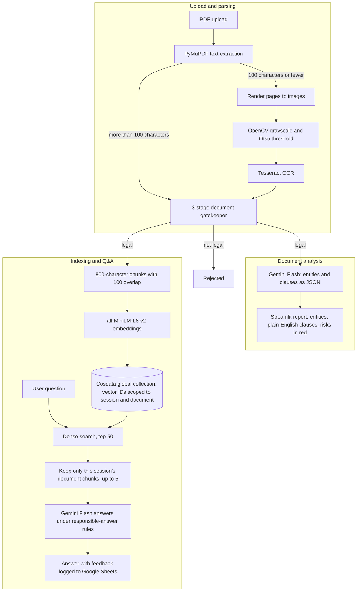
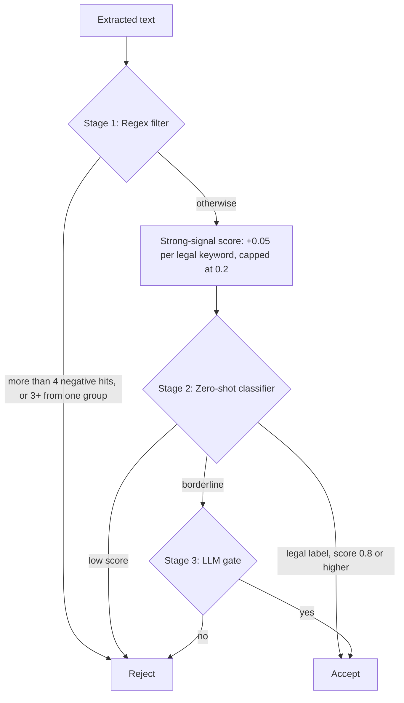

<div align="center">

# ⚖️ AI-Powered Legal Aid for Common Citizens

**Upload a legal document. See each clause explained in plain English with its risks flagged, then ask questions that get answered only from that document.**


**[Watch the 3-minute demo](https://youtu.be/dzDFZkL8zMQ)** · Built for the Cosdata Hackathon 2025

[Features](#what-it-does) · [Architecture](#how-it-works) · [Gatekeeper](#the-document-gatekeeper) · [Problems solved](#problems-i-ran-into) · [Setup](#getting-started) · [Roadmap](#roadmap)


> [!IMPORTANT]
> This project explains what a legal document says. It does not give legal advice and is not a substitute for a lawyer.

## Why I built this

Legal documents are written in language most people can't comfortably read, and paying a lawyer to go through every agreement isn't realistic for most citizens. So people sign things they only half understand.

I wanted a tool where anyone could upload a document, find out what each clause actually means, see what could go wrong before signing, and ask follow-up questions in plain language, without the tool pretending to be their lawyer.

## What it does

| Feature | Details |
|---|---|
| Document gatekeeper | A three-stage check (regex, zero-shot classifier, small local LLM) rejects files that aren't legal documents before any analysis runs. |
| Hybrid parsing | Digital PDFs are read directly with PyMuPDF. Scanned PDFs are detected automatically and sent through OpenCV preprocessing and Tesseract OCR. |
| Entity extraction | Gemini pulls out individuals, companies, organizations, dates, addresses, emails and phone numbers. |
| Clause analysis | Each clause gets a title, a type (Termination, Payment, Liability, Confidentiality, Governing Law, Force Majeure, General or Other), its original text, a plain-English summary, and its potential risks, shown in red. |
| Document Q&A | A RAG chatbot answers from the most relevant chunks of the user's own document. |
| Responsible answers | Advice questions get the facts plus a clear "I can't advise you" note. Malicious requests are refused. If the answer isn't in the document, the bot says so. |
| Feedback | Every answer has 👍 / 👎 buttons and a comment box, and feedback is logged to Google Sheets. |

## How it works



1. **Parse.** `src/pipeline.py` tries PyMuPDF first. If the text layer gives back 100 characters or fewer, the PDF is treated as a scan: each page is rendered to an image, converted to grayscale with Otsu thresholding, and read by Tesseract.
2. **Validate.** The [gatekeeper](#the-document-gatekeeper) decides whether the text is a legal document. Anything that isn't stops here.
3. **Index.** `src/cosdata_store.py` splits the text into 800-character chunks with 100 characters of overlap, embeds each one with `all-MiniLM-L6-v2` (384 dimensions), and upserts them into a single Cosdata collection inside one transaction. Each vector ID has the form `{session_id}___{document}___{chunk_index}`.
4. **Analyze.** `src/information_extraction/extractor.py` sends the text to Gemini with a prompt that asks for one raw JSON object holding `entities` and `clauses`. `app.py` turns that into the report.
5. **Answer.** A question is embedded and searched against the collection. Only results whose ID belongs to the current session and document are kept, up to 5. These are joined into a context block, and Gemini answers under a fixed set of rules.

## The document gatekeeper

The hackathon version accepted any PDF. Testing after submission showed it would take a non-legal document and run the full legal analysis on it anyway.

The obvious fix was to ask an LLM "is this a legal document?" on every upload. That works, but it adds a model call and extra latency to every single document, including ones a keyword check could reject almost instantly. So the check is layered: the cheapest filter runs first, and a model is only called when the earlier stages can't decide.




| Stage | Method | What it decides |
|---|---|---|
| 1. Regex filter | Keyword groups for common non-legal document types (CV, invoice, email and others), plus a separate list of strong legal signals | Rejects straight away if there are more than 4 negative hits in total, or 3 or more from a single group. Otherwise it scores strong legal signals at +0.05 each, capped at 0.2. |
| 2. Zero-shot classification | [`facebook/bart-large-mnli`](https://huggingface.co/facebook/bart-large-mnli) via Hugging Face Transformers, run on 1,500-character windows around the areas with the most strong signals | If the top label is legal, the strong-signal score is added to the classifier's confidence (capped at 1.0). Legal documents scoring 0.8 or above pass. Low scores are rejected. The middle band moves on to Stage 3. |
| 3. LLM gate | [`google/flan-t5-base`](https://huggingface.co/google/flan-t5-base), run locally on the densest chunk of the document | Gives a final yes or no on borderline documents only. |

A worked example: a document the classifier labels legal with 0.75 confidence and three strong legal keywords scores 0.75 + 0.15 = 0.90, so it passes without ever reaching Stage 3. The same document with no strong keywords stays at 0.75, lands in the borderline band, and goes to the LLM gate.

Stage 3 uses a small local model on purpose. A yes/no decision on one chunk of text doesn't justify a large hosted model and its per-call cost.

## Problems I ran into

### Running OCR on every page was too slow

The first version rendered every page to an image and ran Tesseract on it, even for digital PDFs that already had perfectly good text inside them. That made processing slow. Now PyMuPDF reads the embedded text layer first, and only documents that come back nearly empty, which is what scanned PDFs look like, go through OCR.

### One collection per user hit a hard limit

My first design gave every user session its own Cosdata collection. The open-source build caps the number of collections, and once that cap was reached the database failed with `MDB_DBS_FULL`. So all documents now live in one global collection, `legal_aid_global_v1`.

A shared collection brings its own risk: chunks from one upload could surface in answers about another. To stop that, every vector ID is scoped as `{session_id}___{document}___{chunk_index}`, and retrieval throws away any result that doesn't carry the current session and document prefix. Each browser session gets a random ID, so answers only draw on the user's own upload.

### Non-legal documents getting through

This is what the [gatekeeper](#the-document-gatekeeper) solves.

### LLM output isn't guaranteed to be clean JSON

The extraction prompt asks Gemini for raw JSON only, but the app doesn't assume it gets that. It first tries to parse the whole response. If that fails, it looks for a fenced JSON block inside the text. A small `find_data` helper also accepts alternate key names (for example `entities`, `extracted_entities` or `entity_extraction`), so a slightly different response shape doesn't break the report.

### A legal chatbot has to know what not to say

The Q&A prompt in `extractor.py` gives Gemini explicit rules, with worked examples, for each kind of question:

| Question type | Example | How the bot responds |
|---|---|---|
| Factual | "When can either party end this agreement?" | Answers directly from the retrieved context |
| Advice | "Should I cancel my contract?" | States what the document says, then makes clear it can't advise on what to do and points to a qualified lawyer |
| Malicious | "How do I exploit this loophole to harm the company?" | Refuses to help with harmful or illegal activity and points to a qualified lawyer |
| Not covered | Anything the document doesn't address | Says the information isn't in the document instead of guessing |

The prompt also tells the model to correct obvious OCR errors, such as "af" for "of". If retrieval finds no chunks at all, the app returns a fixed "couldn't find any relevant information" message without calling Gemini. These rules were checked against a 20-question safety test set, the "gauntlet".

## Tech stack

| Layer | Tools |
|---|---|
| Interface | Streamlit |
| Text extraction | PyMuPDF |
| OCR | Tesseract (`pytesseract`) with OpenCV preprocessing |
| Document validation | Regex, Hugging Face Transformers (`facebook/bart-large-mnli`, `google/flan-t5-base`) |
| LLM | Gemini Flash (`gemini-flash-latest`) via `google-generativeai` |
| Embeddings | `sentence-transformers`, `all-MiniLM-L6-v2` |
| Vector database | [Cosdata OSS](https://github.com/cosdata/cosdata), run in Docker |
| Feedback storage | Google Sheets via `st-gsheets-connection` |
| Deployment | Azure VM (Standard_B2s), Docker, Nginx |
| Testing | pytest |

## Project structure

```
├── app.py                          # Streamlit UI, session IDs, report rendering, feedback logging
├── src/
│   ├── pipeline.py                 # Hybrid parsing (PyMuPDF first, OCR fallback) and indexing
|   |   legal_doc_check.py          # 3-Stage Validation Pipeline to check Whether the Doc Uploaded is Legal or Not
│   ├── cosdata_store.py            # Chunking, embeddings, Cosdata indexing, session-scoped retrieval
│   ├── information_extraction/
│   │   └── extractor.py            # Gemini prompts for entity/clause JSON and the Q&A rules
│   └── ocr_processing/
│       ├── pdf_processor.py        # Renders PDF pages to images
│       ├── image_preprocessor.py   # Grayscale and Otsu thresholding with OpenCV
│       └── image_to_text.py        # Tesseract OCR
├── tests/
│   └── test_image_to_text.py       # OCR test against a sample image
├── documents/samples/              # Sample PDFs and images
├── assets/demo.gif
├── packages.txt                    # System packages for Tesseract and OpenCV
└── requirements.txt
```

## Getting started

<details>
<summary><b>Setup instructions</b></summary>

### Prerequisites

- Python 3.10+
- Docker
- Tesseract OCR
- A Google Gemini API key
- A Google Cloud service account with edit access to a Google Sheet. The sheet needs a worksheet named `Feedback` with the columns `timestamp`, `question`, `answer`, `rating`, `comment`.

### 1. Start Cosdata

```bash
docker pull cosdataio/cosdata:latest
docker run -d --name cosdata-server -p 8443:8443 -p 50051:50051 cosdataio/cosdata:latest
```

The app connects to `http://127.0.0.1:8443` as `admin` with an empty password. If your server is set up differently, change these in `src/cosdata_store.py`.

### 2. Install the project

```bash
git clone https://github.com/Sehajk005/cosdata-hackathon-project.git
cd cosdata-hackathon-project

python -m venv venv
source venv/bin/activate        # Windows: venv\Scripts\activate

pip install -r requirements.txt
```

Install the system packages for OCR:

```bash
# Ubuntu / Debian
sudo xargs apt install -y < packages.txt

# macOS
brew install tesseract
```

### 3. Add your secrets

Create a `.env` file in the project root:

```env
GOOGLE_API_KEY=your-gemini-api-key
```

Create `.streamlit/secrets.toml` for the Google Sheets feedback connection:

```toml
[connections.gsheets]
spreadsheet = "your-google-sheet-url"
type = "service_account"
project_id = "your-project-id"
private_key_id = "your-private-key-id"
private_key = "your-private-key"
client_email = "your-service-account-email"
client_id = "your-client-id"
auth_uri = "https://accounts.google.com/o/oauth2/auth"
token_uri = "https://oauth2.googleapis.com/token"
auth_provider_x509_cert_url = "https://www.googleapis.com/oauth2/v1/certs"
client_x509_cert_url = "your-cert-url"
```

Both files are already in `.gitignore`.

### 4. Run

```bash
streamlit run app.py
```

The app opens at `http://localhost:8501`.

### Tests

```bash
python -m pytest
```

The OCR test needs Tesseract installed.

</details>

## Data and privacy

- Document text is sent to the Gemini API for analysis and for answering questions.
- Document chunks are stored in the Cosdata collection, identified by a random session ID. There are no user accounts.
- Feedback logs the timestamp, question, answer, rating and comment to Google Sheets. Answers can quote the document, so a feedback entry may contain details from it.
- Stored chunks and temporary upload files aren't cleaned up automatically yet.

To ask for your feedback data to be removed, email sehajk2048@gmail.com.

## Known limitations

- **Retrieval at scale.** Search returns the top 50 vectors from the whole shared collection, and the session filter is applied afterwards. As more documents are indexed, a user's own relevant chunks can fall outside those 50, and the bot will say it found nothing.
- **Chunking.** Chunks are fixed 800-character windows, so they can cut through the middle of a sentence or clause. A review after submission found chunking problems, which is part of why the RAG layer is being rebuilt.
- **Prototype scope.** It was built under hackathon time pressure and tested on a small set of legal documents. Retrieval quality and answer accuracy haven't been formally evaluated yet.
- **Hand-set thresholds.** The gatekeeper thresholds were chosen by hand. Baseline metrics are being collected.
- **Prompt-level rules.** Grounding and the responsible-answer rules are prompt instructions. They keep answers close to the document, but they aren't a guarantee.
- **Concurrency.** Uploads are processed synchronously, and the embedding model and both Hugging Face classifiers are held in memory, so simultaneous users compete for CPU and RAM.
- **LLM output.** Plain-English summaries and risk flags can be incomplete or wrong. Anything important should be checked with a qualified lawyer.

## Project history

| Version | What changed |
|---|---|
| v1 | Deployed on Streamlit Community Cloud. OCR ran on every page, the whole document was passed to Gemini for Q&A, and feedback was logged to Google Sheets. [Repository](https://github.com/Sehajk005/Ai-Powered-Legal-Aid-for-Common-Citizens) |
| v2 (Cosdata Hackathon 2025) | Hybrid parsing, RAG over Cosdata with session-scoped retrieval, responsible-answer rules, the red-flag risk report, and deployment on Azure. |
| v3 | The three-stage document gatekeeper. |
| Next | A multi-agent rebuild, described below. |

## Roadmap

The next version is a rebuild, not a patch. It moves from a single pipeline to a multi-agent system built on a **blackboard architecture**: agents with separate responsibilities (document understanding, legal knowledge, and later drafting and other actions) read from and write to one shared, strictly validated state, coordinated by an orchestrator. Actions with real legal consequences will need human approval before they run.

- [x] Architecture design for the multi-agent version
- [x] Blackboard state schema in Pydantic, with strict validation and immutable state updates
- [ ] Baseline metrics for the gatekeeper
- [ ] Rebuild the RAG layer from scratch
- [ ] Hybrid retrieval: dense vectors plus BM25 sparse search, merged with Reciprocal Rank Fusion
- [ ] Agents and orchestration on top of the blackboard
- [ ] Test suite for the multi-agent system

## Acknowledgements

- [Cosdata](https://github.com/cosdata/cosdata) for the open-source vector database and the hackathon this version was built for
- The authors of [`facebook/bart-large-mnli`](https://huggingface.co/facebook/bart-large-mnli), [`google/flan-t5-base`](https://huggingface.co/google/flan-t5-base) and [`all-MiniLM-L6-v2`](https://huggingface.co/sentence-transformers/all-MiniLM-L6-v2)

## Citation

```bibtex
@misc{legalAidAI2025,
  title        = {AI-Powered Legal Aid for Common Citizens},
  author       = {Sehaj Khurana},
  year         = {2025},
  howpublished = {\url{https://github.com/Sehajk005/cosdata-hackathon-project}},
  note         = {A Responsible AI project for LLM alignment in the legal domain}
}
```


## Author

**Sehaj Khurana**, Computer Science Engineering, Chitkara University

[GitHub](https://github.com/Sehajk005) · [LinkedIn](https://www.linkedin.com/in/sehaj-khurana-8b0200359) · sehajk2048@gmail.com
